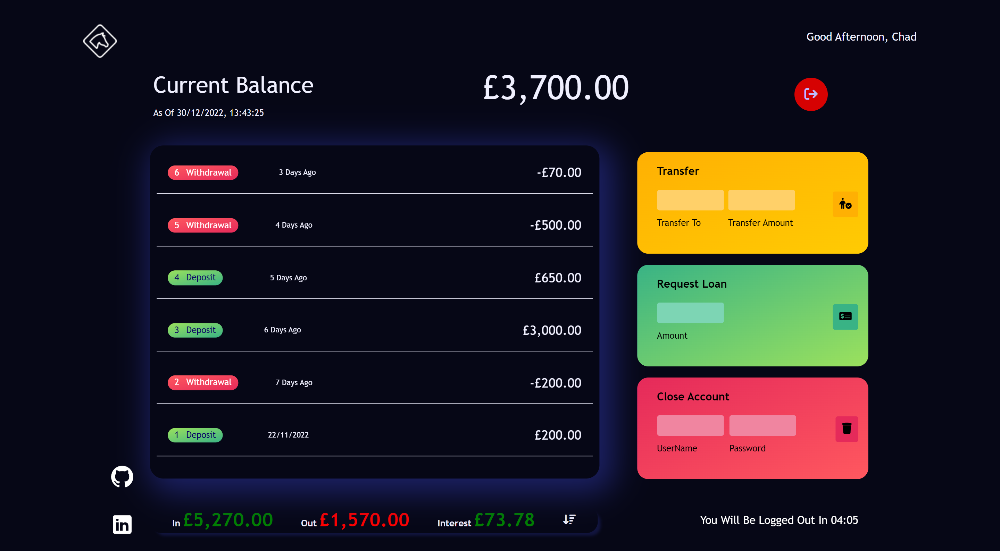

## Bankify Demo

A simple project generalizing basing JavaScript concepts combined to one.

### Deployment

- [Website preview](https://hassanshakur.github.io/bankify_demo/)

### Process

Start by logging in with any of these accounts

- Account 1 userName `ab`, password `1111`.
- Account 2 userName `cd`, password `2222`.
- Account 3 userName `ef`, password `3333`.
- Account 4 userName `gh`, password `4444`.

You can view `transactions`, transfer funds to the other accounts, request a loan, close the account, logout etc.
